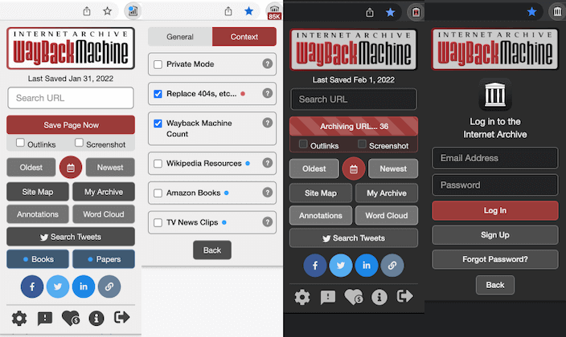

# Wayback Machine Web Browser Extension

In cooperation with [Google Summer of Code](https://summerofcode.withgoogle.com), The [Internet Archive](https://archive.org) presents *The Official Wayback Machine Extension*. With the power of the Wayback Machine, we let you go back in time to see how a URL has changed and evolved through the history of the Web!

## Features

- **Save Page Now** - Instantly save the page you are currently viewing in the Wayback Machine. Turn on *Auto Save Page* in settings to save pages that have not previously been saved. Must be logged in to use.
- **Oldest, Newest &amp; Overview** - View the first version of a page or the most recently saved in the Wayback Machine. Or view a calendar overview of all archived pages.
- **Replace 404s, etc...** - When an error occurs, automatically check if an archived copy is available. Checks against 4xx &amp; 5xx HTTP error codes.
- **Wayback Machine Count** - Display count of snapshots of the current page stored in the Wayback Machine.
- **My Web Archive** - Save URLs to your public archive page on the Internet Archive.
- **Annotations** - Provides a list of annotations for the current web page and domain, provided by [Hypothes.is](https://web.hypothes.is).
- **Relevant Resources** - View archived digitized books while visiting *Amazon Books*, research papers and books while visiting *Wikipedia*, and recommended *TV News Clips* while visiting news websites.
- **Site Map &amp; Word Cloud** - Present a sunburst diagram for the domain you are currently viewing, or create a *Word Cloud* from the link's anchor text of the page you are on.
- **Tweets &amp; Share Links** - Search Twitter for information regarding your current page, or share archived links on social media.

## Installing the Extension

Follow the link below to install the latest deployed version for your web browser.

| [  Chrome](https://chrome.google.com/webstore/detail/wayback-machine/fpnmgdkabkmnadcjpehmlllkndpkmiak) | [  Edge](https://microsoftedge.microsoft.com/addons/detail/wayback-machine/kjmickeoogghaimmomagaghnogelpcpn) | [  Firefox](https://addons.mozilla.org/en-US/firefox/addon/wayback-machine_new/) | [  Safari](https://apps.apple.com/us/app/wayback-machine/id1472432422?mt=12) |
| -- | -- | -- | -- |

## Installing the Latest Build from Source

First tap on the **Code** button, **Download ZIP**, unzip the file in a location where you can find on your computer, then follow the steps below for your browser.

### Chrome

1. Open Chrome and navigate to `chrome://extensions` in your browser. You can also access this page by clicking on the 3 vertical dots menu on the top-right, hovering over **More Tools**, then selecting **Extensions**.
2. Turn on the switch next to **Developer mode**.
3. Click the **Load unpacked** button and select the `wayback-machine-webextension/webextension` directory that contains this code.
4. Click on the *Extensions* puzzle-like icon in the toolbar.
5. Now click on the **Pin** icon next to *Wayback Machine* to pin it.
6. Click on the newly added icon.
7. Read the terms, then *Accept and Enable*. Click on the icon again to use the extension.

See [What are extensions?](https://developer.chrome.com/extensions) for more information on Chrome extensions.

### Edge

1. Open Edge and navigate to `edge://extensions` in your browser. You can also access this page by clicking on the 3 horizontal dots menu on the top-right, then clicking **Extensions**.
2. Turn on the switch next to **Developer mode**.
3. Click the **Load unpacked** button and select the `wayback-machine-webextension/webextension` directory that contains this code.
4. Click on the newly added icon in the toolbar.
5. Read the terms, then *Accept and Enable*. Click on the icon again to use the extension.

### Firefox

1. Open Firefox and navigate to `about:debugging` in the browser. You can also access this page by clicking on the hamburger menu on the top-right, select **Add-ons**, then the **Gear Tools button** on the top-right, then **Debug Add-ons**.
2. Click **This Firefox** on the left.
3. Click **Load Temporary Add-on...**
4. Open the `wayback-machine-webextension/webextension` directory and select any file.
5. Click on the newly added icon in the toolbar.
6. Read the terms, then *Accept and Enable*. Click on the icon again to use the extension.

See [Temporary installation in Firefox](https://extensionworkshop.com/documentation/develop/temporary-installation-in-firefox/) for more information on Firefox extensions.

### Safari 14+

This will require Xcode to compile from source.

1. Open Safari.
   - If Develop menu is hidden, go to Preferences > Advanced > check "Show Develop menu in menu bar".
   - Then Develop menu > Allow Unsigned Extensions (enter password).
2. Open the project file `safari/Wayback Machine.xcodeproj` in Xcode. Click Play to run.
3. Follow directions in splash window:
   - Safari menu > Preferences > Extensions tab.
   - Check to activate Wayback Machine.
   - Select "Always Allow on Every Website..." button and confirm.
4. Click on the newly added icon in the toolbar.
5. Read the terms, then *Accept and Enable*. Click on the icon again to use the extension.

## Renamed Repo

If you previously used the command line to clone this repo, note that it has been renamed. To update your local copy, run one of the following commands from the repo's directory.

*SSH:* `git remote set-url origin git@github.com:internetarchive/wayback-machine-webextension.git`

*HTTPS:* `git remote set-url origin https://github.com/internetarchive/wayback-machine-webextension.git`

## Provide Feedback

If you have a GitHub account, please check the [list of existing issues](https://github.com/internetarchive/wayback-machine-webextension/issues) (bugs are tagged red), then create a **New issue** to file a Bug report or Feature request.

## Contributing Code

To contribute code and docs to the Wayback Machine Web Extension, please read the following:

- [Contribution Guide](CONTRIBUTING.md)
- [Style Guide](STYLE_GUIDE.md)
- [Testing Guide](TESTING_GUIDE.md)

## Credits

- Richard Caceres [@rchrd2](https://github.com/rchrd2)
- Rakesh Naga Chinta [@rakesh-chinta](https://github.com/rakesh-chinta)
- Abhishek Das [@abhidas17695](https://github.com/abhidas17695)
- Mark Graham [@markjgraham](https://github.com/markjgraham)
- Benjamin Mandel [@BenjaminMandel](https://github.com/BenjaminMandel)
- Anton Shiryaev [@Eagle19243](https://github.com/Eagle19243)
- Kumar Yogesh [@kumarjyogesh](https://github.com/kumarjyogesh)
- Vangelis Banos [@vbanos](https://github.com/vbanos)
- Kerry Rodden [@kerryrodden](https://github.com/kerryrodden)
- Max Reinisch [@MaxReinisch](https://github.com/maxreinisch)
- Anish Kumar Sarangi [@anishsarangi](https://github.com/anishsarangi)
- Pushkit Kapoor [@tikhsuP](https://github.com/tikhsuP)
- Carl Gorringe [@cgorringe](https://github.com/cgorringe)

## License

Copyright © 2017-2021 Internet Archive. All rights reserved.

Licensed under the terms of the [GNU Affero General Public License version 3 (AGPLv3)](LICENSE).
